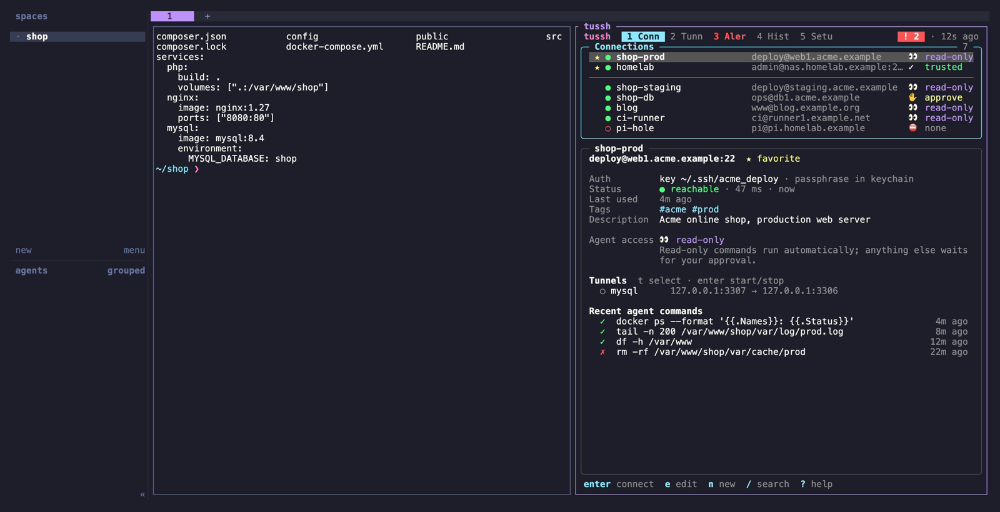
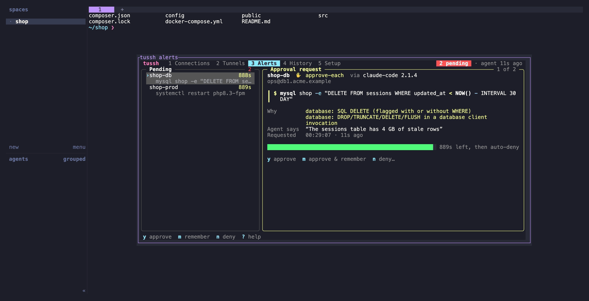

# herdr-tussh

Run [tussh](https://github.com/baeroe/tussh) in a [herdr](https://herdr.dev) split pane or in its own tab. tussh is an SSH connection manager with access control for AI agents. herdr-tussh works the same way as [herdr-lazydocker](https://github.com/sudoeren/herdr-lazydocker) and [herdr-lazysql](https://github.com/baeroe/herdr-lazysql).



*`open-tussh`: tussh in a split next to the shell you were working in.*

| Action | Does |
|---|---|
| `open-tussh` | Toggles tussh in a split to the right: opens it, focuses it, or closes it when it is focused |
| `open-tussh-tab` | Toggles tussh in its own tab: opens it, switches to its tab, focuses it, or closes it when it is focused |
| `alerts` | Opens `tussh alerts --popup` as a popup. The popup closes by itself once every request it showed has been decided. |

tussh itself knows nothing about herdr: when an agent needs approval and no tussh TUI is open, it only sends a macOS notification. Bind `alerts` to a key if you want to open the pending requests as a popup yourself.



*`alerts`: pending agent requests in a popup; it closes by itself once all of them are decided.*

The tussh pane is found by its label (`tussh`). If `jq` is missing or `herdr pane list` fails, the actions simply open a new tussh pane.

The plugin starts `tussh` from `PATH`, falling back to `~/.local/bin/tussh`. The herdr server often runs without `~/.local/bin` on its `PATH`. To use a different binary, set `TUSSH_BIN`.

Connections, access levels and approvals all belong to tussh. The plugin only opens it.

## Requirements

| Tool | Why |
|---|---|
| `tussh` | the SSH manager (`make install` in the tussh repo, which puts it in `~/.local/bin`) |
| `jq` | toggle logic (without it, every invocation opens a new pane) |
| herdr 0.9.3+ | |

## Install

```sh
herdr plugin install baeroe/herdr-tussh
```

Add key bindings to `~/.config/herdr/config.toml`:

```toml
[[keys.command]]
key = "alt+h"
type = "plugin_action"
command = "herdr-tussh.open-tussh"
description = "tussh"

# optional: tussh in its own tab
[[keys.command]]
key = "alt+shift+h"
type = "plugin_action"
command = "herdr-tussh.open-tussh-tab"
description = "tussh tab"
```

Then run `herdr server reload-config`.

## Tests

```sh
bash tests/run-tests.sh        # toggle decisions, launcher and alerts action against a fake herdr; no herdr needed (runs in CI)
shellcheck scripts/*.sh tests/*.sh
```

## Screenshots

The images in `docs/screenshots/` are rendered from the [VHS](https://github.com/charmbracelet/vhs) tapes in `docs/tapes/` with demo data only:

```sh
brew install vhs pngquant oxipng   # vhs pulls ttyd and ffmpeg
bash docs/screenshots.sh           # or: bash docs/screenshots.sh alerts
```

The script needs a [tussh](https://github.com/baeroe/tussh) checkout next to this repo (or `TUSSH_REPO=…`) and reuses its demo data: `docs/demo/seed.go` (connections on `*.example` hosts, an audit log), a real `tussh mcp` that leaves two approval requests pending, and `docs/demo/tui.go` (the normal TUI with a simulated reachability check, passed in via `TUSSH_BIN`). It starts a separate herdr server with its own `HOME` in a throwaway sandbox, with only this plugin linked, so your own herdr session is never touched. The demo config binds the actions to `ctrl+b h` and `ctrl+b a`. Everything is removed afterwards.

## Credits

The toggle logic is adapted from [herdr-lazydocker](https://github.com/sudoeren/herdr-lazydocker) (MIT) by Eren Çakar, by way of herdr-lazysql.

## License

MIT, see [LICENSE](LICENSE).
